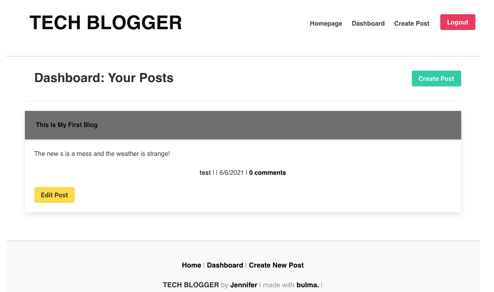

# mvc-blogger

https://mvc-blogger.herokuapp.com/
<br />
https://cleanjenn.github.io/mvc-blogger/

## Mock Up



## Table of Contents 

- [Mock Up](#mock-up)
- [Description](#description)
- [User Story](#user-story)
- [Installation](#installation)
- [Usage](#usage)
- [Contributing](#contributing)
- [Questions](#questions)
## Description 
```
I built a CMS-style blog site similar to a Wordpress site, where developers can publish their blog posts and comment on other developers’ posts as well. This site was completely built from scratch and deployed to Heroku. This app follows the MVC paradigm in its architectural structure, using Handlebars.js as the templating language, Sequelize as the ORM, and the express-session npm package for authentication.

```
## User Story 
```
AS A developer who writes about tech
I WANT a CMS-style blog site
SO THAT I can publish articles, blog posts, and my thoughts and opinions
```
## Installations 
`npm init`<br />
`npm i bcryptjs`<br />
`npm i bulma`<br />
`npm i connect-session-sequelize`<br />
`npm dotenv`<br />
`npm i express`<br />
`npm i express-handlebars`<br /> 
`npm i express-session`<br />
`npm i jest` update package.json `"test-dev":"npm test"`<br />
`npm i mysql2`<br />
`npm i node` <br />
`npm i nodemon` update package.json `"watch":"nodemon server.js"`<br />
`npm i seeds` <br />
`npm i sequelize`
## Usage
```
Users are able to create an account to post on their blogs meanwhile commenting on others post. When a user is not logged in they are able to see all the blogs displayed in the homepage. 
```
## Contributions

[Jennifer](https://github.com/cleanjenn)

## Questions 

Feel free to contact me via email: <br /> [Email](mailto:jennifer23gomez7@gmail.com)<br /> 
[Github](https://github.com/cleanjenn)<br />